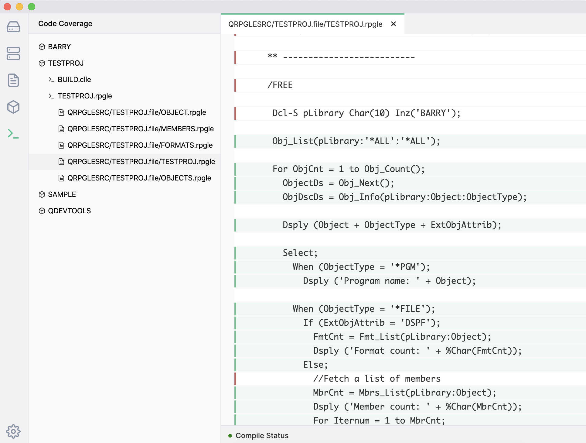
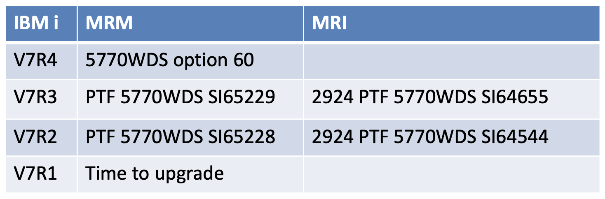

Code Coverage allows the users to determine which lines of code were and were not executed.

The Code Coverage panel displays a list of libraries (coming from the Library List setting in ILEditor 2) and when you click on the library it will display a list of programs inside of it. Clicking on the program will execute it under code coverage and will display a list of sources from the coverage results. Clicking on the source will open up the coverage result in a new tab.

The coverage tab will display the source code used from the test. If the line is highlighted green, it means the line was executed. If there is a red bar to the left of it, it means the opposite.

Internally, the Code Coverage plugin uses the `CODECOV` command. While you can pass in program parameters to this command, the plugin simply calls the program with no parameters:

```clike
CODECOV CMD(CALL PGM(${library}/${name})) MODULE((${library}/${name} *PGM *ALL))
```

When the test is executing, it will use the library list defined in the Settings for ILEditor 2.

Note that for Code Coverage to work you need to make sure

1. that `QDEVTOOLS` is on your library list.
2. the correct PTFs are installed (which are free).



As of 0.6, you are now able to import existing `.cczip` files into the editor. Meaning you can run code coverage outside of ILEditor 2 and then view the contents at a later time.
