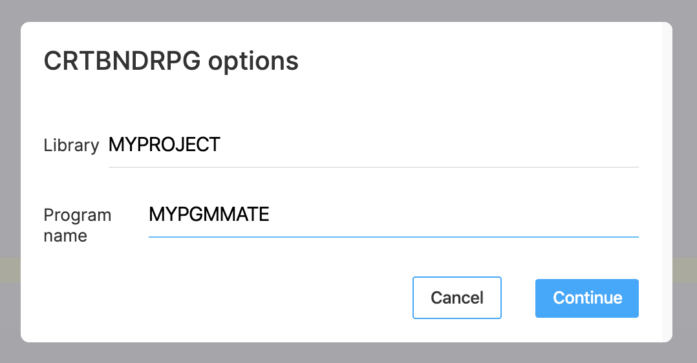
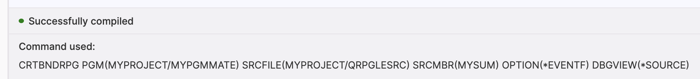

Whenever you open a source member or streamfile, you have the ability to compile it using the settings you defined inside of the Compile Settings inside of ILEditor 2.

You can use the Ctrl + E / Command + E shortcut to compile source code, in which, if you have options defined for that extension, will you show for you to select:

Defined compile options for SQLRPGLE inside of the `QSYS` file system (a source member):


Will show those options when you use the compile shortcut.


Clicking on one of the options will then submit the compile in a new job.

The error listing window will show you three important things:

1. **Command that was used** to build the source code.
2. **Compiler messages** - this is great because it will also display binding errors.
3. **Errors in the sources** used for the compilation (which may include includes/copies). Errors are clickable, which will take you to the line and column used of the error.

Things to note when compiling code:

- Your library list for the job that executes the defined command is in the Settings for ILEditor 2.
- For the error listing to display, you need to compile your sources with the `*EVENTF` option (because it generates the error listing outfile)

**Note**: Compiling code is available in the core version. Editing the compile settings is only available in ILEditor 2 Pro.

## Custom user input

As of 0.8.1, users can now define custom variables in the compile commands which would prompt to the user when they use that compile option.

The command string now accepts a new variable format. It looks like this.

```
${NAME|LABEL|[MAXLENGTH]|[DEFAULTVALUE]}
${desc|Description|50}
${objectName|Object name|10|&BUILDLIB}
```

It takes 4 different options:

1. The ID of the input box. Also known as the name.
2. The label which will show next to the input box.
3. Max length of the input box. **optional**
4. Default value in the text box. **optional** and max length required to use it.

#### Examples

```json
{
    "RPGLE": {
        "QSYS": {
            "CRTBNDRPG_PGM": "CRTBNDRPG PGM(&OPENLIB/${pgm|Program name|10}) SRCFILE(&OPENLIB/&OPENSPF) SRCMBR(&OPENMBR) OPTION(*EVENTF) DBGVIEW(*SOURCE)",
            "CRTBNDRPG_LIB": "CRTBNDRPG PGM(${lib|Library|10}/${pgm|Program name|10}) SRCFILE(&OPENLIB/&OPENSPF) SRCMBR(&OPENMBR) OPTION(*EVENTF) DBGVIEW(*SOURCE)",
        }
    }
}
```

* `CRTBNDRPG_PGM` shows a simple single input box.
* `CRTBNDRPG_LIB` shows the ability of using two inputs in one command. You can see the result of these in the screenshots below.


