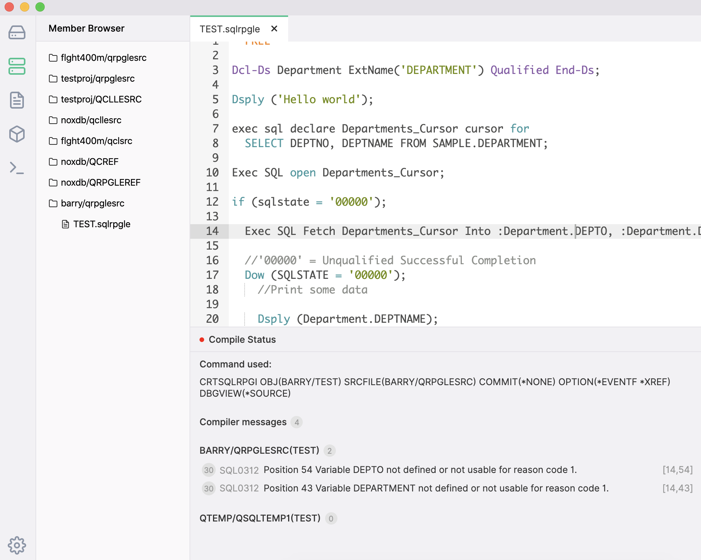
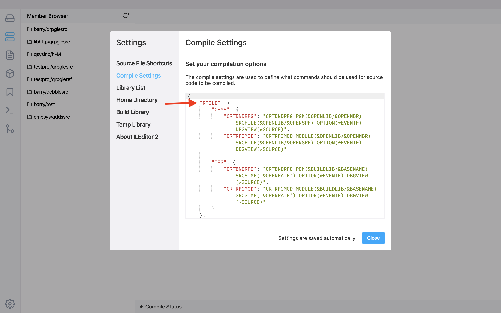
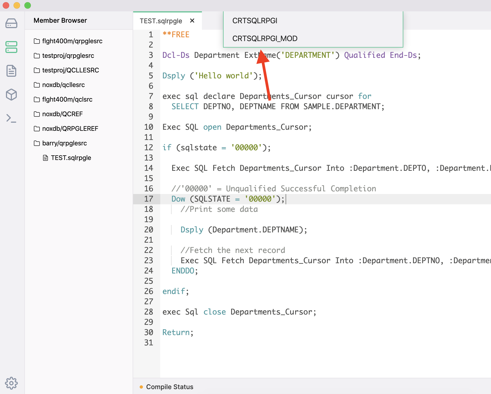

Whenever you open a source member or streamfile, you have the ability to compile it using the settings you defined inside of the Compile Settings inside of ILEditor 2.

You can use the Ctrl + E / Command + E shortcut to compile source code, in which, if you have options defined for that extension, will you show for you to select:

Defined compile options for SQLRPGLE inside of the `QSYS` file system (a source member):

Will show those options when you use the compile shortcut.

Clicking on one of the options will then submit the compile in a new job.

The error listing window will show you three important things:

1. **Command that was used** to build the source code.
2. **Compiler messages** - this is great because it will also display binding errors.
3. **Errors in the sources** used for the compilation (which may include includes/copies). Errors are clickable, which will take you to the line and column used of the error.

Things to note when compiling code:

- Your library list for the job that executes the defined command is in the Settings for ILEditor 2.
- For the error listing to display, you need to compile your sources with the `*EVENTF` option (because it generates the error listing outfile)
