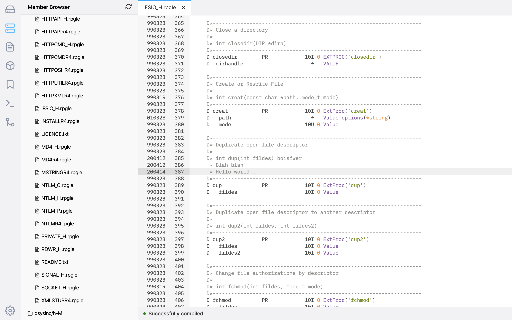

To edit source members, you can use the Member Browser. If you read the Settings page, you should know that for source files to display in this list they need to be added in the Settings for ILEditor 2.

**To add items to the list** open up the ILEditor 2 Settings and select the 'Source File Shortcuts'. On this panel, there is a button that says 'Add Shortcut' and this will allow you to enter a path to the source file. For example, `MYLIB/QRPGLESRC` or `MYLIB/QCLLESRC` are valid paths.

When you click on a source file, it will load a list of members inside of it along with it's associated extension. The extension correlates to which syntax highlighting is used. When you click on a source member, it should open up in a tab where the code can then be edited.

You are able to right-click on source files and members which will show you the related context menus.

You can save with Ctrl + S / Command + S, plus all regular editing shortcuts can be used (like undo, redo, etc).

### Source dates

**Note: In order for the source date column to be retained, you will need to have `db2util` installed on your IBM i. `db2util` is available through the yum package manager.**

You will know when the source dates are being retained as you will see the source date appear before the line number when editing. If you do not have `db2util` installed, you will still be able to edit source code but the source date column will not be retained.

Supported db2util versions:

* 1.0.10

## Record limit

As of 0.5.2, we now enforce the record format limit in source members. If you try and edit over the record limit in a member, you will be prompted before saving.
