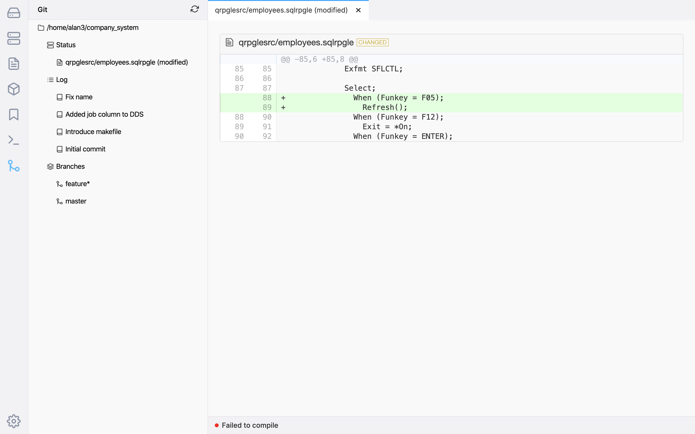

The git client for ILEditor 2 is special in that it is a client that runs on the server. To use the git client in ILEditor 2, `git` needs to be installed via the yum package manager for IBM i, which is available for IBM i 7.2 and above.

The git client will use whatever your home directory is set to in the ILEditor 2 settings, so be sure that it is a git repository.

The git client will show 3 items:

* Status - which allows you to see the status of your files (like running `git status`). Only when you click on a file that has changed, the diff will be displayed. If you right click on the Status item, you will see options to interact with your repository.
* Log - which will show you the last 50 commits in the repo. When you click on a commit, it will show you a list of files changed in that commit. When you click on a file in the commit, it will show you the diff of that change.
* Branch - will show a list of branches, tagged with an asterisk with your current branch.

### Status

Opening the Status item in the tree will show you staged and un-staged items in the current tree. These are indicated with `+` (staged) and `-` (un-staged). You can right click to stage/unstage, or restore.

Right clicking on the Status items will show such options like commit, push, etc.
