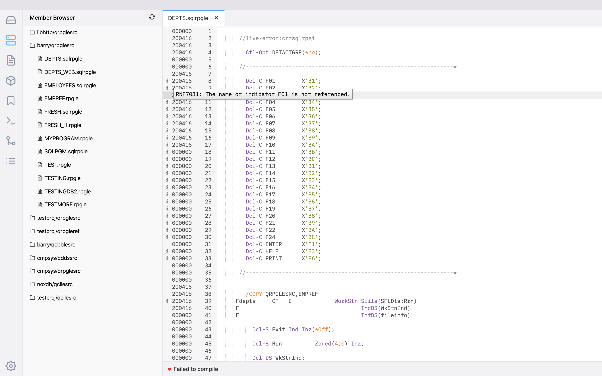

The Live Errors feature allows you to see compile-time errors while you're writing your code. Live Errors utilizes your Compile Settings (found in the ILEditor 2 Settings) to determine what commands to use to compile your application.

In order to enable Live Errors for your source code, the first five lines of the source needs to contain a tag to tell ILEditor 2 which compile option to use to fetch the errors. From there, every time you save the source it will go out and fetch the listing.

For example, if you have two compile options for RPGLE:

```json
{
    "RPGLE": {
        "QSYS": {
            "CRTBNDRPG": "CRTBNDRPG PGM(&OPENLIB/&OPENMBR) SRCFILE(&OPENLIB/&OPENSPF) OPTION(*EVENTF) DBGVIEW(*SOURCE)",
            "CRTRPGMOD": "CRTRPGMOD MODULE(&OPENLIB/&OPENMBR) SRCFILE(&OPENLIB/&OPENSPF) OPTION(*EVENTF) DBGVIEW(*SOURCE)"
        }
    }
}
```

You could use either:

* `live-errors: crtbndrpg` to run the CRTBNDRPG option
* `live-errors: crtrpgmod` to run the CRTRPGMOD option

You can also see it being used in the screenshot above.

**Notice**: If you have a slow development system, you might find that it takes a while for the notices to show up. If live errors are slowing down your work, disable the feature by removing the tag. Right now, we have found that Live Errors only works for sources not using Embedded SQL (e.g. none of the `CRTSQL*` commands) from the IFS and rare instances in source members.

### Live Errors and RPGLE

When using Live Errors with RPGLE source code, you will also be able to use features like:

* Hovering over variables to see definition information
* Go to definition
* Peak all references