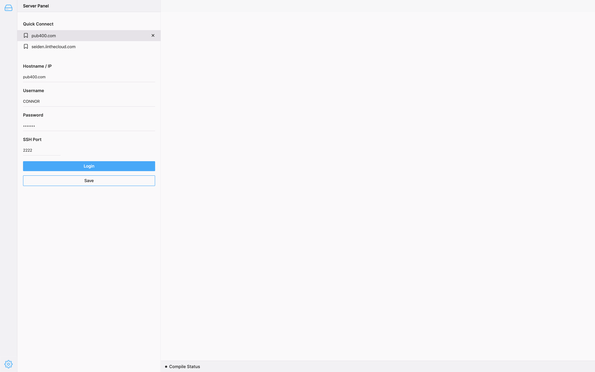
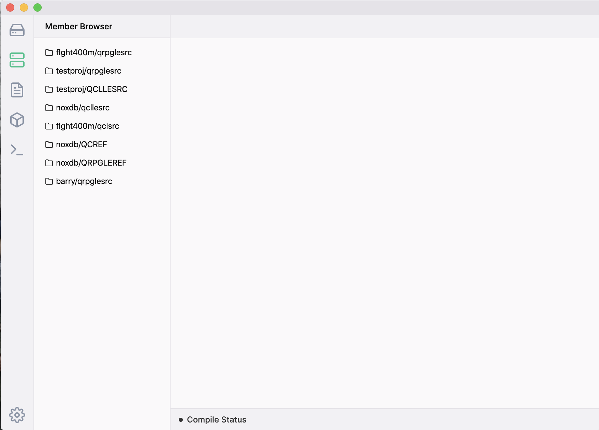

When you launch ILEditor 2, you will only be prompted to enter a hostname (or IP), username and password. ILEditor 2 is completely SSH driven, so your IBM i system must have the SSH Daemon started.

You will also see a Quick Connection list the is pre-filled with "pub400.com". Clicking on this will fill out the hostname and port used to connect to pub400.com. To update this quick connection you can enter a username and password and then click on the "Save" button located at the bottom.

Creating a new quick connection is as simple as filling out the connection details and clicking the save button. If the hostname matches up with a connection already in your list then it will be updated with the new details.

Hovering your cursor over a quick connection will display a cross icon to the right of the name, clicking on this will delete the saved connection.

Selecting login will attempt to log into the system. The panel on the left, named the activity bar, is a list of plugins enabled inside of ILEditor 2 (like the Member Browser and IFS Browser). After you have logged in these should become enabled. Clicking on an item in the activity bar will change the panel to your selected item.

The bar at the bottom with the text 'Compile Status' is known as the compile bar. When you compile source code (using Ctrl+E / Command+E), the status is updated and uses different colours to indicate the compiled state.

The cog in the bottom left is the button to display the ILEditor 2 settings.

## Item filter

You'll find that the Member Browser and IFS Browser have a filter. This is useful to filter source files and directories that have a lot of source/files. Note, this is not search functionality. It is a filter for list already fetched from the server.
