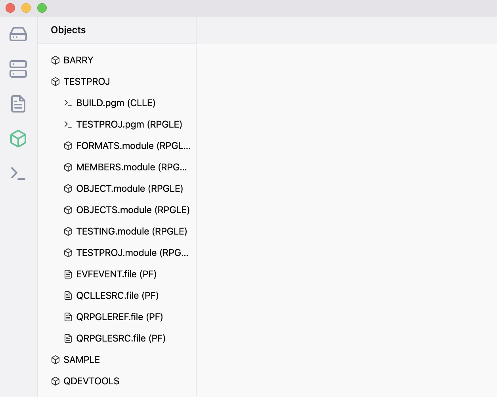

The Object Browser allows you to see a list of objects inside a library. The list of libraries for the Object Browser comes from the library list defined in the ILEditor 2 settings.

Clicking on a library will display all objects inside of the library, where the extension is the type of object. Clicking on certain types of objects will do certain things:

- `FILE` (`PF/LF`) - displays columns inside of the table.
- `BNDDIR` - displays all binding entries inside of the binding directory.

You are also able to right click on a PF and select an option to view the contents of the PF/table.
