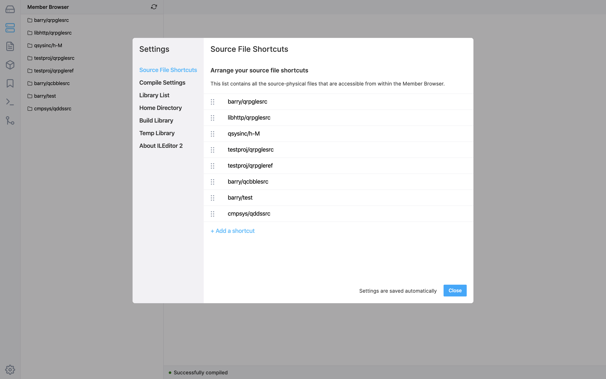

This is the settings window. On the left is a list of different configurable settings, and the more-right group is where the selected setting can be edited.

### SPF Shortcuts

This list is the list of members which will be displayed in the Member Browser panel. For example, if you wanted to edit source in `DEVLIB/QRPGLESRC`, then you should add it to the list first. The order in which the items are will be reflected in the panel also.

### IFS Shortcuts

This is a list of directories which will be displayed in the IFS Browser panel. For example, if you wanted to edit source in `/home/USER/myfolder`, then you should add it to the list first. The order in which the items are will be reflected in the panel also.

### Compile Settings

The compile settings is a JSON editor in which the compile options are stored.

- Top-level properties are for the type of extension (like `RPGLE` or `CLLE`)
- The next object down from that is for the file system type - either `QSYS` (source members) or `IFS` (streamfiles)
- The type object is a key-value list of compile options and their command.

You will also see a `common` top level property, which will be available for all types of source code.

When you install ILEditor 2, there will already be default properties. You are not able to edit the Compile Settings in the Core version of ILEditor 2.

### Library List

This will let you change the library list for compilations (and other things). You can add, remove and re-order items in this list.

### Home Directory

The home directory is the directory that will be used in the IFS Browser as the root but will also be the jobs working directory when building from the IFS. The home directory is also used in the git plugin as the working git repository.

### Build Library

This library is used to build objects into when building source code out of the IFS.

### Temp Library

ILEditor 2 needs a temp library to store information for your working session. If there are multiple people in a company using ILEditor 2, it is recommended that they all share the same Temp Library. The files (not programs!) in this library can be cleared regularly as they may build up in storage, preferably when no one is working.

It is common to use a scheduled job to do this:

```
ADDJOBSCDE JOB(ILECLEAN) 
           CMD(DLTOBJ ILEDITOR/*ALL *FILE) 
           FRQ(*WEEKLY) SCDDATE(*NONE) 
           SCDDAY(*ALL) SCDTIME('23:59:59') 
           TEXT('Clear ILEditor 2 temporary data')
```

### Theme

This setting will allow you to change themes within the editor.
