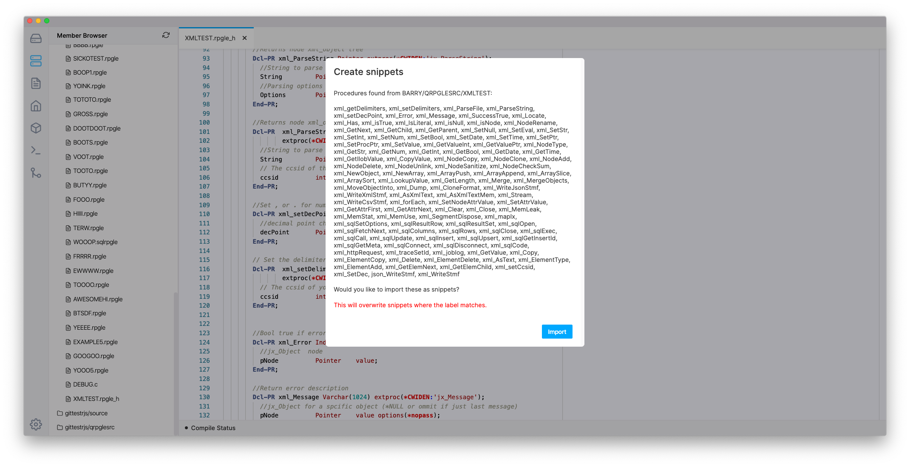

Snippet Settings, available in 0.7.8, allows you to define templates or snippets of code to make developing application code easier.

Snippets are language independent. You define groups of snippets for each language. You will find there is examples for the RPGLE language by default. 

## Definition

Extensions are always in uppercase. The array for each extension must match the object `SnippetSuggestion` defintion as follows:

```ts
interface SnippetSuggestion {
  /** The text shown in the content assist. */
  label: string;

  /** Information about this snippet. */
  documentation: string;

  /** Text to be inserted, with user input fields. */
  insertText: string;

  /** Type of snippet/suggestion. Accepts any CompletionItemKind key. */
  kind?: 'Snippet'|'Function'|string;

  /** Which header this belongs too. If provided, will only be shown when header file in copied/included in the source code. Supports (SQL)RPGLE only. */
  api?: string;
}
```

### Example

```json
{
    "RPGLE": [
        {
            "label": "IF ...",
            "documentation": "A basic IF statement",
            "insertText": "If (${1:Condition});\n  ${2:Code}\nEndif;"
        }
    ],
    "CLLE": [
        {
            label: "DCL Character",
            "documentation": "Define a character variable",
            "insertText": "DCL   &${1|NAME}  *CHAR  LEN(${2|LENGTH})"
        }
    ]
}
```

---

#### Pro features

## Import from header

**Note: This supports RPGLE headers only**.

This new import features will scan an RPGLE header file for prototypes and then import them as snippets (`type: 'Function'`), which will make writing code easier when using those RPGLE procedures.

To use this feature, in the File dropdown, you will find 'Import RPGLE to snippets', in which a modal will appear. This modal will run you through steps to import these prototypes are snippets. Then, anywhere where the chosen header file is used will be able to use those snippets.

