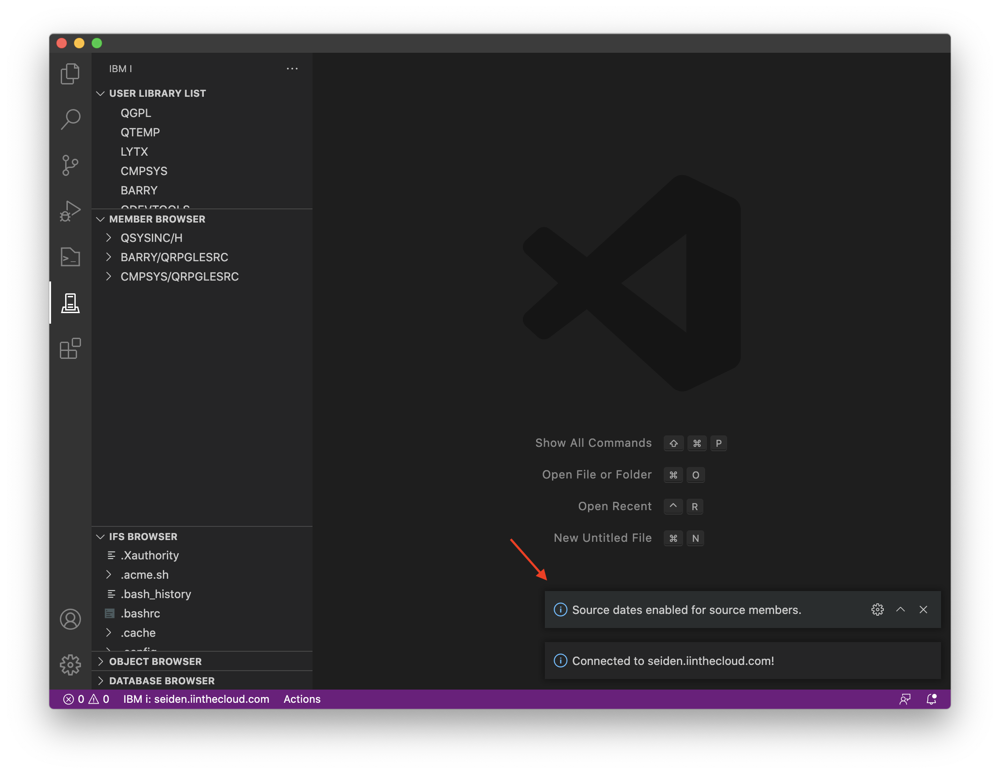

The source date feature, when installed, requires no configuration. Before you connect to your IBM i, make sure you have the extension installed.

`db2util` is required for Source Dates support. You can install `db2util` via yum, on IBM i.

When you connect to your system, you will be prompted whether Source Dates support is enabled or not.

