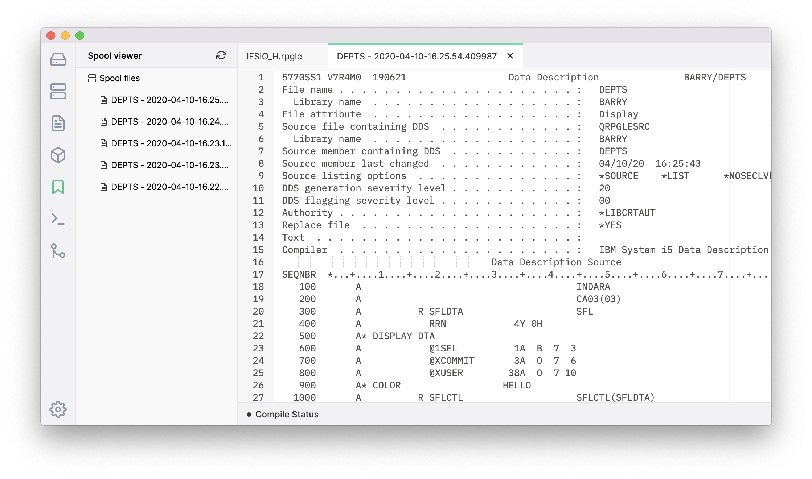

**Note: In order to use the Spool File Viewer, you will need to have `db2util` installed on your IBM i. `db2util` is available through the yum package manager.**

The spool viewer uses the Db2 for i SQL services to return a list of spool files for the user profile that is connected to the system.

```sql
SELECT * from QSYS2.OUTPUT_QUEUE_ENTRIES 
WHERE USER_NAME = '${user}' and 
      OUTPUT_QUEUE_LIBRARY_NAME != 'QUSRSYS' 
order by create_timestamp desc
```

Clicking on the spool file will open the contents in a new tab.