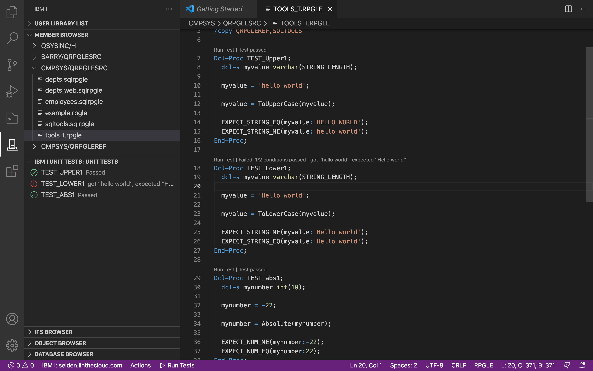
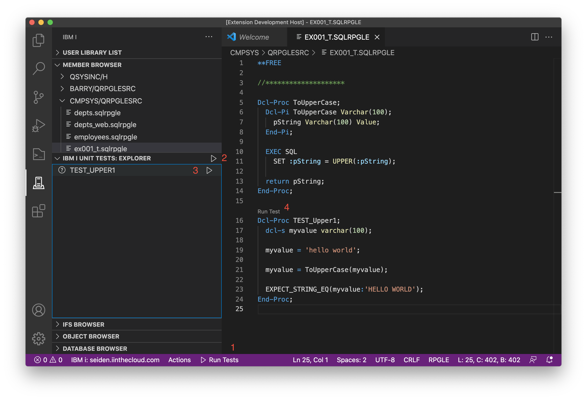

The Unit Testing extension supports testing RPGLE applications with the integrated unit testing framework.

[After installing the Unit Testing extension](https://code.ileditor.dev/download), Code for IBM i will automatically detect test files. You will have the ability to run tests right from the active editor. You can also see inline results in the active editor or the Unit Test Explorer view.

Nothing needs to be installed on the host IBM i to make use of the Unit Testing framework.

## Example test walkthroughs

Unit Tests are RPGLE procedures that reside in a source member or streamfile. The name must end with `.test` or `_t` (case-insensitive). For example, some valid names might be:

* `mytest_t.rpgle`
* `T0001_T.sqlrpgle`
* `test0001.test.sqlrpgle`

Each source allows you to define multiple tests as their own procedures that start with `TEST_` (case-insensitive). For this section, create a new source member or streamfile named `EX001_T.sqlrpgle`. Unit tests can include other procedures that are not using tests.

We're going to create a member with a procedure that we will use to test against, followed by the real test procedure.

```rpgle
**FREE

//********************

Dcl-Proc ToUpperCase;
  Dcl-Pi ToUpperCase Varchar(100);
    pString Varchar(100) Value;
  End-Pi;

  EXEC SQL
    SET :pString = UPPER(:pString);

  return pString;
End-Proc;

Dcl-Proc TEST_Upper1;
  dcl-s myvalue varchar(100);

  myvalue = 'hello world';

  myvalue = ToUpperCase(myvalue);

  EXPECT_STRING_EQ(myvalue:'HELLO WORLD');
End-Proc;
```

In most cases, you will want to test other service programs. You are able to use `CTL-OPT` to include a binding directory. Use the `/COPY` or `/INCLUDE` directives to include the prototypes.

```rpgle
**FREE

Ctl-Opt BNDDIR('CMPSYS/TOOLS');

//Includes 'ToUpperCase'
/copy QRPGLEREF,SQLTOOLS

Dcl-Proc TEST_Upper1;
  dcl-s myvalue varchar(STRING_LENGTH);

  myvalue = 'hello world';

  myvalue = ToUpperCase(myvalue);

  EXPECT_STRING_EQ(myvalue:'HELLO WORLD');
  EXPECT_STRING_NE(myvalue:'hello world');
End-Proc;
```

## Running Tests

Tests will run using the library list setup in your connection. They are built every time you run your tests. You will see the results update in the active editor and also update in the Explorer view.

There are many ways to run your tests or even run a specific test.

1. Run Tests button at the bottom
2. Run Tests button in the Explorer view
3. Run Test test button in the Explorer view
4. Run Test link which appears in the active editors


